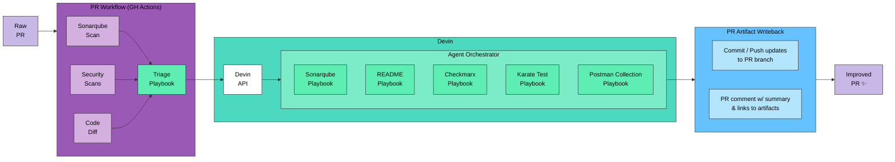

# Simplified System Spec (Aligned to Diagram)

## 1️⃣ Entry Point

### Raw PR

A developer opens or updates a Pull Request.  
That’s the only trigger in Phase 1.

---

## 2️⃣ PR Workflow (GitHub Actions Layer)

The PR triggers a GitHub Actions workflow that runs three core checks:

### SonarQube Scan

-   Static analysis
    
-   Code quality findings
    
-   Maintainability issues
    

### Security Scans

-   SAST (e.g., Checkmarx)
    
-   Dependency vulnerabilities
    
-   Secret detection
    

### Code Diff Analysis

-   Detect contract changes (OpenAPI, proto, etc.)
    
-   Detect changed services/controllers
    
-   Detect coverage regression
    
-   Detect test file updates (or lack thereof)
    

All three feed into:

### Triage Playbook (Decision Engine)

The Triage step does one thing:

-   Classifies scan results
    
-   Decides which playbooks to invoke
    
-   Calls the Devin API Orchestrator

---

## 3️⃣ Devin Layer

### Devin API

Receives:

-   Repo context
    
-   PR metadata
    
-   Scan outputs
    

Launches an orchestration session.

---

## 4️⃣ Agent Orchestrator

Coordinates specific playbooks:

### SonarQube Playbook

Triggered when:

-   Quality gate fails
    
-   Code smells / bugs detected
    

Action:

-   Fix safe maintainability issues
    
-   Re-run scan
    
-   Attach evidence
    

---

### README Playbook

Triggered when:

-   OpenAPI/proto changed
    
-   Docker/Makefile/config changed
    
-   New endpoints detected
    

Action:

-   Update README
    
-   Sync setup instructions
    
-   Update usage examples
    

---

### Checkmarx Playbook (Security)

Triggered when:

-   High / critical findings detected
    

Action:

-   Apply secure coding fixes
    
-   Upgrade dependencies if needed
    
-   Validate scan passes
    

---

### Karate Test Playbook

Triggered when:

-   Diff coverage below threshold
    
-   Code changed without tests
    
-   New endpoints added
    

Action:

-   Add or update API-level tests
    
-   Ensure new logic is covered
    
-   Validate tests pass
    

---

### Postman Collection Playbook (Utility)

Triggered when:

-   Repo is a microservice (API surface exists)
    
-   Contract changes detected (OpenAPI/proto/controllers/routes)
    
-   New endpoints/params/auth headers detected
    

Action:

-   Generate or update Postman collections (and related env files if present)
    
-   Ensure requests reflect current routes, payload shapes, and auth headers
    
-   Keep collections consistent and reusable for future developers
    
-   Validate collection structure (basic lint / schema sanity checks)
    

Primary output:

-   Updated Postman collection artifacts committed to the PR branch
    

---

## 5️⃣ PR Artifact Writeback

After playbooks run, the system performs standardized writeback:

### Commit / Push updates to PR branch

-   Devin commits changed artifacts (code, tests, README, Postman collections)
    
-   Pushes to the same PR branch so changes are reviewable
    

### PR Comment summary

-   Adds a comment summarizing what changed
    
-   Links to updated files / evidence (scan results, test runs if available)
    

---

## 6️⃣ Output

Result: **Improved PR ✨**

-   Cleaner code
    
-   Updated tests
    
-   Updated README
    
-   Updated Postman collections (for microservices)
    
-   Security issues addressed
    
-   Scans passing
    
    

---

